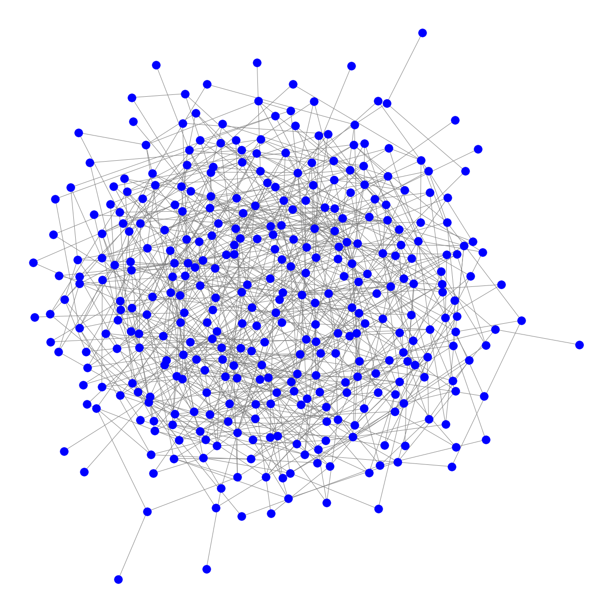
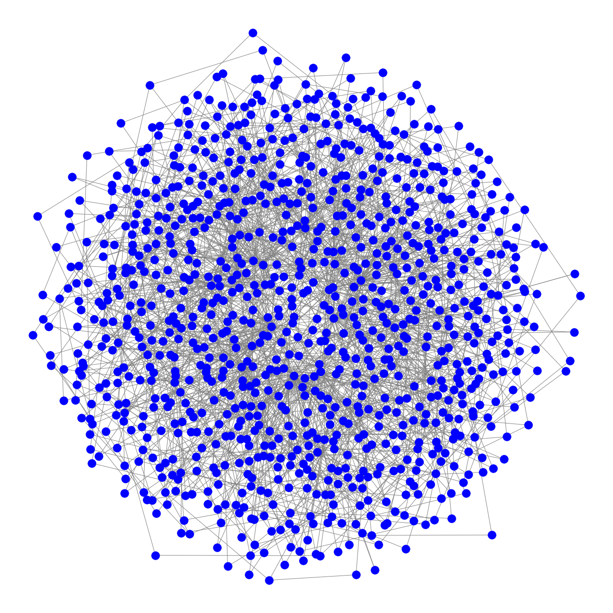
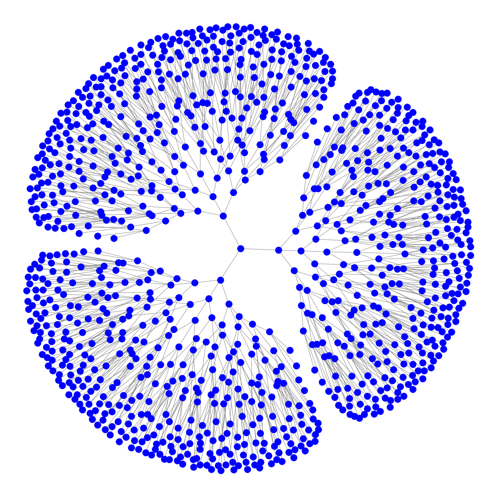

# Lab 2

Для использования в программе был выбран Kamada & Kawai layout algorithm. 

Он уже использовался для рисования графа в первой лабораторной работе (этот алгоритм зашит внутри draw_kamada_kawai), для наглядности на новых графах я вызвал его отдельно с помощью функции kamada_kawai_layout.

Полный код всё так же в файле Graph.ipynb.

Три получившихся отображения графов:

